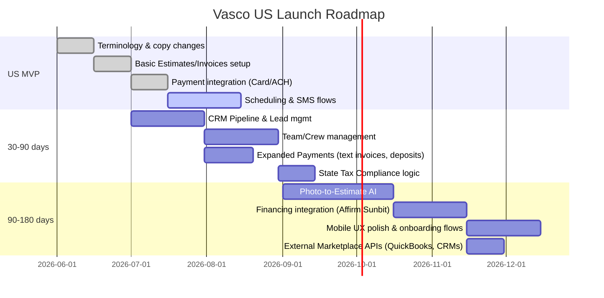

# Executive Summary  
The U.S. home‐service market is far larger and more growth‐driven than Europe’s. About 80% of U.S. contractors are solo or small operators【13†L42-L47】, yet they compete in a $520+ billion industry growing ~3%/yr【37†L102-L110】.  American tradesmen focus on winning revenue and scaling (e.g. paying $8.8K/yr on home projects【23†L63-L66】, using consumer financing【23†L58-L66】), whereas European contractors often emphasize efficiency and admin.  This means the EU‐centric app must shift from “invoice/quote” workflows toward a CRM/sales‑first, lead‑driven model.  Feature priorities (estimates, pipeline, SMS, financing, crew mgmt) and copy (U.S. terms, growth/“pro” messaging) must all be reworked.  Below we analyze market differences (with implications) and lay out a prioritized US roadmap, UX/copy adjustments, automation scripts, GTM checklist, and risk mitigation strategies.  

## Section A — Market Comparison (EU vs US)  

| Aspect                | European Contractor Market                            | U.S. Contractor Market                                              | Implications (Product, Copy, Onboarding, GTM)                                                 |
|-----------------------|-------------------------------------------------------|---------------------------------------------------------------------|-----------------------------------------------------------------------------------------------|
| **Buyer focus**       | Efficiency and compliance (reduce admin, **VAT**, labor regs); “craftsman” identity.  | Growth and revenue (“close more jobs, run a pro business”), heavy sales/marketing mentality【23†L63-L66】.  | Messaging: switch from “stop losing money on admin” (EU) to “win more jobs, scale revenue” (US).  Onboarding: emphasize ROI and lead-gen, not just organization.                    |
| **Language/Terms**    | “Invoice,” “quotation/offer,” *tradesman*, *Rechnung*, *Angebot* etc.  | “Estimate/proposal,” “quote” (bid), “field service software,” *pro/contractor*, *invoice*.  | UI/UX & copy: replace EU terms (Invoice auf Deutsch) with US terms (Estimates, work orders). E.g. “Quote” vs “Estimate” usage.  US copy uses “owner/operator,” “crew,” “billing.”  |
| **Sales/Lead process**| Often word-of-mouth or broker (e.g. MyHammer-type services).  Formal sales pipeline less common; mostly reactive quoting.  | Proactive lead gen: Google/Facebook Ads, websites, even TikTok content.  CRM pipeline (leads→estimates→won jobs) is critical【31†L77-L84】【52†】. | **Feature change:** Add full CRM/pipeline module. Integrate online booking, lead forms, call tracking.  Onboarding: prompt setup of “lead stages” and follow-ups (SMS/email automations).        |
| **Workflows**         | Quote (often verbal or PDF) → scheduling (sometimes ad-hoc) → invoice (often bank transfer) → payment (bank transfer).  | Lead → *Estimate/Proposal* → Job scheduling/dispatch → Completion → Invoice → Payment (cash/credit).  Automated reminders and digital approvals common【31†L72-L80】【31†L82-L90】. | Add Workflow: “Click → Accept → Pay” flow.  SMS/email reminders at each step. Introduce online approvals and payment links.  Job/task management for small crews.           |
| **Payment norms**     | Bank transfers (SEPA), some credit cards, late 30+ day terms common.  VAT invoices legally required.  | Immediate payments expected: cash, checks, credit/debit, ACH.  Popular “Pay-Over-Time” (BNPL) options (Affirm, Sunbit) to win big jobs【23†L58-L66】. Subscription pricing (SaaS) is normal.  | **Feature:** Integrate credit-card/ACH payments (Stripe/Square), plus consumer-financing APIs【23†L58-L66】. Display payment link on invoices. Onboarding to set default payment terms (0–30 days). |
| **Crew size**         | Often solo or 2‑3 person teams.  (EU data varies by country, but small crew).  | Also mostly solos/small (NAHB: single‑family GC ~4 emp, remodelers 3‑4【13†L93-L100】).  But U.S. pros are often more sales-driven even as solos.  | Support multi‑tech teams with simple scheduling and time tracking.  But start as “single-pro” friendly. User profiles vs team roles. UI must feel robust for both solo and crew.          |
| **Regulation**        | VAT/invoicing regulations, local licensing varies by country.  GDPR data rules strict, but small apps often exempt.  Union/permit rules in some EU countries.  | State licensing (plumbing, electrical licenses differ by state), 1099 contractor classification (e.g. CA’s AB5 risks), no VAT but sales tax tracking per state.  | Tax: Allow sales-tax rates per state. Invoice template USA-friendly. Legal: built-in license tracking per state? Data privacy: comply with CCPA and emerging state laws (CA, VA).         |
| **Financing options** | Some E-shop financing, but BNPL on home services is rare.  | Widespread “Buy Now, Pay Later” (Sunbit, Affirm, etc.) for home repair【23†L58-L66】. Many contractors offer quick loan approvals.  Equipment financing also common.  | Integrations: partnership or API with lenders (Affirm/Sunbit) to let contractors offer financing. UI: button in estimate for financing option. Feature flag for future financing.         |
| **Marketing channels**| Europe: more fragmented by country – local SEO, word-of-mouth, trade fairs.  Less TikTok for contractors (varies by country).  | U.S.: Heavy online advertising (Google Search, FB/Instagram, LinkedIn for commercial), plus influencer/TikTok presence (“TikTok for tradies” trend).  Local networks (Angi, HomeAdvisor).  | GTM: Invest in Google Ads (“best contractor app”), Facebook/Instagram ads targeted by trade. Use TikTok for branding (“$X revenue per day with app” style). SEO for “best app for [trade] near me.”   |
| **Pricing sensitivity**| Price‐sensitive (avg. revenue smaller); often fixed-price or low margin projects.  Preference for low‐cost tools.  | Higher ticket work (HVAC, remodeling) yields bigger margins. Contractors willing to pay for growth tools if ROI proven (e.g. Housecall Pro ~$50/mo)【31†L99-L107】.  | Pricing: Tier by crew size or features; US plans often start ~$60/mo【31†L99-L107】. Highlight ROI (“close jobs faster”). Consider free trial or lead-ins (free scheduling). Onboarding should demonstrate quick wins (e.g. send first invoice in minutes). |
| **Key competitors**   | EU: localized apps (in Germany: Handwerker.de, MyHammer; UK: Tradify, ServiceM8; SE: PlanRadar, etc.).  Few with broad US-scale funding.  | US: Large incumbents – Jobber, Housecall Pro, ServiceTitan (commercial focus), FieldEdge, Breezeworks.  Also new AI entrants (Honchō, Buildertrend).  | Must differentiate from incumbents. Opportunity to own “AI operator” niche. Leverage AI features (photo-estimate, auto-bids) as wedge. Onboarding: show AI assist early. Pricing: Competitive but value-emphasized.            |
| **Distribution/GTM**  | EU: Mixed. Online (App stores), trade associations, national media (Houzz EU?), some dealer networks.  Multi-lingual site.  | US: App Stores + web, plus heavy reliance on online ads. Integration partners (QuickBooks, Stripe) help distribution.  Google/SEO presence critical (“best home service software 2026”).  | **Content:** Build U.S.-focused SEO/AEO content (“best contractor app in TX”, “[trade] scheduling tips”), state+trade AEO pages. Launch cities/states via state pages. Paid: Google Search + Facebook. Partnerships: QuickBooks, local wholesalers (Sonepar for electricians), trade orgs (NASE, NFIB).         |
| **Answer-Engine Queries (AEO)** | EU queries vary by language (“Beste App für Handwerker”), often detailed local issues.  | U.S. example queries: “best app for electricians in California”, “how to send an estimate to customer”, “HVAC scheduling software”, “accept credit card payments [state]”, etc.  Many seek “how-to” answers for operations.  | Create AEO pages answering exact questions (see Section C). Use local context (e.g. “[State] contractor app”) and match US terminology. Leverage ChatGPT-style answers for queries (include them on SEO pages).   |

_**Key takeaway:**_ US tradesmen behave like small business owners obsessed with leads, revenue, and closing jobs (often via integrated finance), while European trades often focus on admin efficiency.  This requires **new features (CRM pipeline, financing, SMS)** and **messaging pivot (growth/“pro”-oriented language)**.  

## Section B — Product Roadmap & Feature Specs  

**MVP (Days 0–30):** Lay the groundwork with U.S. core features and terminology.  
- **Terminology Swap:** Replace EU terms. E.g. “Quote” → “Estimate”, “Trade” → “Pro/Contractor”, include “Proposal” option (see [29†L134-L142], [31†L81-L90]). Swap “Invoice” date formats (MM/DD). Remove VAT fields; add Sales Tax logic.  
- **Estimates vs Quotes:** Enable both. An *Estimate* is rough (not locked), a *Proposal* can be signed. Data inputs: line items, labor hrs, markup. Outputs: PDF with logo, signature capture. UI: On mobile, “New Estimate” button leading to item list. Accept/invoice flows: if customer approves, convert to job/invoice. *Example:* Joe gets photo of damaged roof, app suggests $X estimate (see AI feature below).  
- **Invoicing & Payments:** Accept card/ACH. Integrate Stripe/PayPal API. Inputs: Invoice total (from estimate or job hours). Outputs: payment link, receipt. UI: “Collect Payment” screen (see Jobber UI below). Third-party: Stripe or Square SDK; banks for ACH (Plaid?). *Acceptance:* Payment successfully posts and marks invoice paid; must handle retries/failures.  
- **Scheduling/Dispatch (basic):** Move beyond calendar. UI: list of jobs, drag-to-schedule (like Housecall’s drag calendar【31†L72-L80】). Inputs: job date/duration, assign tech. Use Google Calendar API for notifications. *Acceptance:* Tech sees assigned jobs in app, gets push/SMS reminders.  
- **SMS & Email workflows:** Integrate SMS gateway (Twilio). Data: job events (Booked, On My Way, Completed). On each, send templated texts (e.g. “Technician [Name] is on the way”). *UI:* Admin interface to edit message templates. *Criteria:* 98% deliverability of reminders, opt-in management.  
- **Basic UI Localization:** Ensure U.S. English copy in all screens. Use en-US spellings (“fiber”, “meter” if needed). Ensure date format, currency ($), units (imperial vs metric if applicable) are correct.  

**Milestone (Day 30):** Core “Estimate→Job→Invoice→Pay” flow live for single-pro. Simple pipeline visual. Early adopters in, say, Texas pilot launch.  



**30–90 Day (Q2):** Build growth tools.  
- **CRM/Pipeline:** Lead tracking from inquiry to won/lost. Inputs: lead info (name, contact, job description). Provide Kanban (status columns). UI: “New Lead” form; pipeline dashboard (like Housecall’s Pipeline)【9†L23-L31】. Auto-create a lead when estimate not accepted. Acceptance: >50% of leads convert or are followed up via app.  
- **Crew Management:** Add “Team” feature. Inputs: tech profiles, skill tags, working hours. Schedule multiple techs per job. UI: crew list, assign/unassign with drag. Geolocation tracking optional (for future). *Criteria:* One job can have multiple workers and each tech can see only their jobs.  
- **Financing Options (consumer):** Integrate Affirm/Sunbit APIs for “Buy Now, Pay Later”【23†L58-L66】. UI: on estimate page, “Offer financing” toggle; integrate lender widget. *Data:* customer credit eligibility result. *Output:* new payment plan on invoice. *Accept:* customer opts BNPL, contractor gets paid up front (subject to risk).  
- **Photo-to-Estimate AI (vision):** Use ML to estimate simple jobs. Inputs: customer-uploaded photo of damage or room. Pipeline: Image → object recognition (e.g. roof, leak) → material+labor database → cost estimate. (Could leverage an AI model via OpenAI/GPT4Vision or a specialized API). UI: “Upload job photo” → auto-generate draft estimate. *Acceptance:* Prototype achieves ±20% of manual quotes on test set.  
- **Tax and Compliance:** Support U.S. sales tax per state (connect to taxJar API). Include 1099 vs W-2 tagging for subcontractors. UI: “Customer address” triggers tax calc. *Criteria:* Tax amounts auto-calculated on invoice; multi-state sales tax settings work.  
- **Extended Communications:** Email marketing tools – newsletter signup, automated postcards (like Housecall’s postcards)【31†L84-L90】. At minimum, post-job review requests via email/SMS.  

**90–180 Day (Q3–Q4):** Polish & expand.  
- **Advanced AI/Automation:**  Virtual “Office Manager” bot: chat interface where user says “Joe needs roof trim quote” and app suggests tasks, pricing. Integrate with GPT or Claude for natural commands. E.g. automating recurring jobs (like customer calls “monthly maintenance”).  
- **Mobile App 2.0:** Revamp UI for multi-job workflows (optimizing multiple tabs). Offline capabilities for crews.  
- **API & Integrations:** QuickBooks Online sync (clients, invoices)【29†L145-L152】; Zapier support; integrate more payments (Square, Google Pay). Connect with major CRM (HubSpot) and home service lead gen sites (Houzz, HomeAdvisor) via API or Zap.  
- **Reporting Dashboard:** Key metrics: *Jobs booked, revenue, open leads, cash flow.* Generate weekly/monthly reports (see ServiceTitan demos).  

**Acceptance Criteria (General):** For each feature above, define unit tests or manual test cases. E.g. “Create a new US job → assign team → collect 50% deposit → mark ‘paid’ → app updates revenue dashboard.”  All flows should work end-to-end.

【52†embed_image】 *Figure: Sample Jobber mobile UI showing a contractor reviewing a completed job and sending an invoice (source: Jobber Google Play listing【29†L134-L142】).*  

【53†embed_image】 *Figure: Example mobile invoice screen (collect payment) in a US field-service app【29†L134-L142】.*  US contractors expect to **close jobs with payment on the spot**【31†L82-L90】.  The app should allow one-tap credit-card entry or payment link sending (Stripe/QuickBooks integration). SMS invoice reminders should follow missed payments (Housecall Pro automates “On my way” and payment texts【31†L77-L84】).  

【58†embed_image】 *Figure: Time-tracking feature (source: Jobber listing【29†L158-L166】).*  Unlike many EU trades, US pros often bill hourly or track overtime. Built-in time entry and GPS tagging (as in Jobber/Housecall) keeps teams accountable. 

【55†embed_image】 *Figure: In-app client chat/reminders (source: Jobber listing【29†L158-L166】).*  US apps emphasize customer communications: status updates and review requests (see Housecall’s “on-my-way” texts【31†L77-L84】). We will build templated SMS/email reminders and easy “request review” buttons.  

【59†embed_image】 *Figure: Dashboard/calendar view (Jobber listing【29†L158-L166】).*  The US solution must offer a unified dashboard: scheduled jobs, unpaid invoices, and leads in one screen. This supports the owner/operator’s need to manage growth (vs. simply record data).  

## Section C — Copy & UX Localizations  

- **Terminology swaps (EU→US):**  
  - *Quote* (EU) → **Estimate/Proposal** (US). E.g., “Create an estimate” instead of “Erstelle Angebot”.  
  - *Invoice* (same word, but US also says “bill” informally).  
  - *Tradesman/Handwerker* → **Contractor/Pro/Technician**.  
  - *Crew/Team* (US) vs “Mitarbeiter” (EU) – focus on team size.  
  - *Admin/Accounting* → *Back-office/Books*. E.g. EU copy: “Entlasten Sie Ihre Administration” → US: “Automate your back-office so you can get back to customers.”  
  - *Quotations* → *Estimates* (see Housecall Pro subtitle: “Quote, Estimate, Invoice App”【31†L33-L41】). Use “Submit online” instead of “Kundenservice”.  
  - *VAT* → *Sales tax*. Remove VAT fields entirely; use “Tax rate” labeling.  
  - Switch to imperial units where relevant (feet, gallons).  
- **App Store (US versions):**  
  - **Title:** “Vasco: Contractor Pro App” (usages suggest “Pro” language).  
  - **Subtitle:** “Close more jobs with quotes, scheduling & invoicing”.  
  - **First 3 lines (App Store):** Focus on pain & solution: e.g. “You’re building, but every day admin steals your profits. . . . Vasco handles scheduling, estimates & payments for you. No more missed invoices or underpriced jobs.”  
  - *Example:*  
    - Line 1 (Hook): “Stop losing profit on every job.”  
    - Line 2: “Vasco automates estimates, invoices & reminders so you get paid in full.”  
    - Line 3: “Run your service business like a pro.”  
- **TikTok Hooks (US style):** Short, high-energy, money-focused. For example:  
  - “I was leaving money on the table… until I tried this app.”  
  - “How I closed a $3,000 job in 5 minutes.”  
  - “Solo plumber → $100K year with this tool.”  
  - “Learn how HVAC techs get paid faster (no more chasing checks).”  
  - “Running a painting biz in 2026? This is how you stand out.”  
- **Onboarding script examples (mobile app flow):**  
  - *Screen:* “Who are you?” Options: “Electrician, Plumber, HVAC, etc.” (tailor later content).  
  - *Screen:* “Set your payment terms.” (“Due in 0 days (COD), 7 days, 30 days…”).  
  - *Screen:* “Create first estimate.” Show fields (item, labor). Hint: “Need help? Tap AI to analyze a photo.” (if AI ready)  
  - *Screen:* “Connect QuickBooks?” (optional). “Accept credit cards? Enable Stripe now.” etc.  
  - Throughout, use “you” (second person) and emphasize pro-owner identity: “You’re doing the work. Vasco handles the rest.”  
- **AEO/SEO prompts (US focus):** Include questions Americans might ask voice assistants or search. For example:  
  1. “What’s the best app for electricians to manage jobs?”  
  2. “How to send an estimate to a client in the US?”  
  3. “Contractor scheduling app for home service”  
  4. “Top plumbing CRM software 2026”  
  5. “How to get paid faster as an HVAC contractor?”  
  6. “Difference between quote and estimate for remodeling”  
  7. “Best invoicing app for [state] contractors”  
  8. “Run a small service business by yourself”  
  9. “How to accept credit card payments on my iPhone”  
  10. “Estimate calculator for roofing job”  
  - These queries should map to landing pages: e.g. “Best app for plumbers in Texas,” “How to price electrical jobs,” etc. (We’ll generate AEO pages accordingly in Section D).

## Section D — Automation Scripts (Claude/pseudocode)  

To scale and streamline copy/feature rollout, here are example routines in Claude-friendly pseudocode (input/output examples provided):  

```yaml
# (a) Transform EU Copy to US English
# Input: EU website/app copy (string). Output: US-variant (string).
function transformEUtoUS(eu_text: String) -> String:
    replace all instances of "quotation" with "estimate"
    replace "invoice" (German contexts) with "bill"
    replace currencies from "€" to "$"
    replace date formats (DD.MM.YYYY to MM/DD/YYYY)
    replace metric units with US units if needed
    apply US idioms (e.g. "Hey, Biz Owner!" vs "Lieber Nutzer")
    ensure spelling EN-US (e.g. "labor" vs "labour")
    return us_text

# Example:
input = "Sofort Angebot erstellen und Angebot senden."
output = transformEUtoUS(input)
# Expected output: "Create and send an estimate instantly."

# (b) Generate US Estimate from Photo/Text
# Input: {photos: [URL], description: String, trade: String}
# Output: {estimate: [items], total_cost, assumptions}
function generateEstimate(data):
    # 1. If photo provided, call vision API (e.g. ChatGPT Vision or Google Vision) to identify objects
    if data.photos:
        objects = VisionAPI.detect(data.photos)
        # Example: detect "bathroom", "leak", "tiles"
    # 2. Parse description for scope
    keywords = NLP.extract(data.description, topics=["repair","install","replace"])
    # 3. Query pricing database by trade
    items = []
    for obj in objects + keywords:
        estimate_line = PricingDB.lookup(trade=data.trade, item=obj)
        items.append(estimate_line)
    total = sum(items.cost)
    return {estimate: items, total_cost: total, notes: "Subject to site inspection."}

# Example:
input = {trade: "roofing", photos: ["s3://bucket/roof.jpg"], description: "Leaking roof corner."}
output = generateEstimate(input)
# Returns line items (e.g. "Replace 20 sq ft shingles: $500", etc.), total ~$1200.

# (c) Populate App Store Fields per State/Trade
# Input: state (String), trade (String), base_title (String).
# Output: {app_store_title, subtitle, keywords}
function getAppStoreEntry(state, trade):
    # Title e.g. "Vasco - Contractor App for [trade] in [state]"
    title = f"Vasco: {trade.capitalize()} App - {state}"
    subtitle = f"{trade.capitalize()} scheduling, estimates & invoices in {state}"
    keywords = [f"contractor app {trade}", f"{state} {trade} estimates", f"field service {state}"]
    return {title: title, subtitle: subtitle, keywords: keywords}

# Example:
getAppStoreEntry("Texas", "plumbing")
# → {title: "Vasco: Plumbing App - Texas", subtitle: "Plumbing scheduling, estimates & invoices in Texas", ...}

# (d) Generate AEO Answer Pages
# Input: query (String).
# Output: {page_title, content_sections: [ {heading, text}... ], suggested CTA}
function generateAEOPage(query):
    # 1. Identify main question keywords
    topics = QueryParser.identifyTopics(query)
    # 2. Pull authoritative content (could use competitor blogs or built Q&A)
    content = KnowledgeBase.fetch(topic=topics)
    # 3. Structure answer:
    title = "How to " + QueryParser.abbreviate(query)
    sections = []
    sections.append({heading: "Overview", text: LLM.answer(query)})
    sections.append({heading: "Key Steps", text: LLM.listSteps(query)})
    sections.append({heading: "Common Mistakes", text: LLM.answer("mistakes " + query)})
    CTA = "Download Vasco to streamline this process."
    return {page_title: title, content_sections: sections, call_to_action: CTA}

# Example:
generateAEOPage("best app for electricians in California")
# Yields a structured FAQ page on choosing apps, ends with CTA to try Vasco.
```

(Above pseudocode is illustrative. In practice, we’d connect Claude with an API or automation workflow. Inputs/outputs can be JSON or YAML.)

## Section E — Go‑To‑Market Checklist  

- **Target Trades:** Start with high-value, common home services: **HVAC, Electrical, Plumbing, Roofing, Landscaping**【7†L61-L68】. (These have large addressable markets and recurring work.) Each gets its own landing content (“Best [trade] app in [state]” page).  
- **Launch States:** Focus on populous, high‐growth states with many contractors【61†L22-L30】【61†L100-L101】: **California, Texas, Florida, New York, Illinois**. (Procore lists ~45k CA, ~42k TX, ~41k FL contractors【61†L22-L30】【61†L100-L101】.) Later expand to Sun Belt states (AZ, GA, NC) where home services boom.  
- **Pricing Strategy:** Tiered SaaS. E.g. Solo plan (~$59/mo, like Housecall【31†L99-L107】) for 1‑2 user, plus “Team” plans ($129/mo) for multi-tech. Consider initial free trial or freemium (e.g. free 1 tech, paid for >2 techs). Offer annual discount. Highlight ROI (e.g. “recoup your fee in one closed job” in copy). Possibly usage-based add-ons (like extra $15/mo per lead management AI).  
- **Partnerships:**  
  - *Accountants:* QuickBooks, Xero (for seamless accounting sync).  
  - *Payment:* Stripe/Square (cards), Affirm/Sunbit (financing)【23†L58-L66】.  
  - *Industry:* Home Depot/Lowes (co-marketing with pro programs), trade schools (offer workshop on tech), local contractor associations (e.g. local BBB or NFIB chapters).  
  - *Software:* Integrate with CRM systems (Salesforce, HubSpot) and lead-gen sites (Houzz, Angi) via API partnerships.  
- **KPIs:**  
  - *Product:* Activation rate (first estimate sent), time-to-first-paying-customer, churn rate.  
  - *Growth:* MRR, CAC (cost/user via ads), LTV.  
  - *Engagement:* # of estimates/jobs per month per user, app session frequency.  
  - *Support:* NPS/customer satisfaction (ask in-app surveys).  
- **Content/SEO Plan:** Build a library of ~50 AEO pages before launch. For each trade×major state (“Top app for electricians in Texas”, “How plumbers schedule jobs”, etc.). Ensure each answers specific user queries (see Section D). Localize into Spanish for TX/CA. Maintain FAQ sections.  
- **Paid Channels:** Google Search Ads (“contractor scheduling app”, “HVAC invoicing software”), Facebook/Instagram ads targeting small business owners in selected zip codes (e.g. near hardware stores), LinkedIn ads for commercial contractors, TikTok/YouTube ads with quick case studies (“This app made me $X more”). Retargeting ads to site visitors with “Get 3 free estimates” offer.  
- **Compliance/Legal:**  
  - **Licensing:** Include liability disclaimers (“pricing is estimate only”), ensure in-app terms. Potentially a “non-contractual estimate” warning.  
  - **Privacy:** Comply with CCPA (California privacy law) and emerging state privacy rules. Add consent banners as needed.  
  - **Payment:** Follow PCI compliance for card storage, embed Affirm with its disclosures (as in [23†L95-L103]).  
  - **Contractors Law:** Include info on 1099 vs employee to warn users (non-advice). (AB5 in CA may classify some workers—future feature to generate 1099s.)  

## Section F — Risks & Mitigation  

- **Competition from incumbents:**  Housecall Pro, Jobber and ServiceTitan already dominate. *Mitigation:* Differentiate on AI and niche focus. Emphasize unique “AI assistant” features (e.g. photo estimates, natural-language commands) as a moat. Target smaller segments first (one trade or state) rather than chasing all at once. Leverage faster iteration (we are leaner startup vs huge org).  
- **Feature gaps:** Risk of missing a critical US feature (e.g. no QuickBooks sync or lacked offline mode). *Mitigation:* Rapid user feedback. Release features in agile sprints and invite pilot users to beta. Prioritize backlog based on what generates fastest ROI for users.  
- **Regulatory/Legal:** Misclassification (AB5) could technically make users worry about 1099s; sales tax is complex; BNPL has finance regulations. *Mitigation:* Provide clear disclaimers that Vasco isn’t legal advice. Possibly integrate QuickBooks (“Hey QuickBooks handles tax output”). Ensure all lender integrations meet federal/state rules (display APR per truth-in-lending, as Affirm release shows【23†L96-L104】).  
- **Market fit:** US pros may have entrenched habits (e.g. pen-and-paper). *Mitigation:* Smooth UX; minimize friction (e.g. easy mobile UI, minimal required fields). Use referral incentives (e.g. $20 off for referring a friend) to grow network. Provide dedicated support during early rollout.  
- **Data privacy:** Transition from EU (GDPR) to fragmented US regs (CCPA, etc.) could cause compliance issues. *Mitigation:* Apply best practices (encrypt data, opt-in consents). Lean on global cloud providers (AWS, Google) who are compliant. For user trust, emphasize “we NEVER share your data” (similar to Affirm’s “no hidden fees” messaging【23†L78-L81】, but for privacy).  
- **Economic sensitivity:** Small businesses can churn if cash flow tightens. *Mitigation:* Offer flexible pricing, pause accounts, and highlight quick value (“you’ll save 3× your subscription in labor after 1 month”).  

**Tables & Images:** See above tables and UI screenshots for concrete examples. For roadmap, see the Mermaid Gantt chart. 

**Sources:** U.S. home services industry reports【37†L102-L110】, NAHB research on contractor demographics【13†L42-L49】, and competitor documentation (Jobber, Housecall, ServiceTitan) were used.  Payment integration info is from industry news【23†L58-L66】. App store excerpts【29†L134-L142】【31†L72-L80】 illustrate functionality and copy style.  

